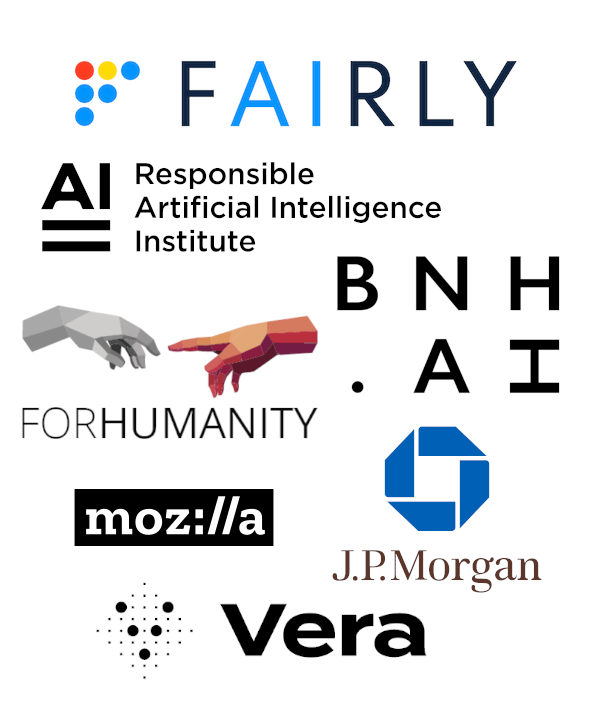

---
header-includes:
- \usepackage{xpatch}
- \xpatchcmd{\itemize}{\def\makelabel}{\setlength{\itemsep}{0.5em}\def\makelabel}{}{}
---

# Risk Checklists

::: {.columns}
:::: {.column}

- We're developing a system that auditors can use
  to monitor known risks that have been found
  in AI systems like those they're investigating.

- We have...
  - Persona and User Story
  - Mockups
  - Proposed API

- We'll be sharing these with our design partners (right),
  including Fairly.ai, who would like to integrate our data
  with their AI risk management platform.

::::
:::: {.column}

::::
:::

# Mockups

\vspace{0.5em}

{ height=22em }

# API

Our API design ergonomically exposes the risk monitoring
features for use in third-party applications.

\tiny

```bash
TAGS='GMF:Known AI Technology:Language Modeling___GMF:Known AI Goal:Question Answering'
curl -G "https://incidentdatabase.ai/api/riskManagement/v1/risks" \
--data-urlencode "tags=$TAGS&risks_added_since=2022-11-01"
```
```json
{
  "risks": [
    {
      "tag": "GMF:Known AI Technical Failure:Misinformation Generation Hazard",
      "precedents": [
        {
          "incident_id": 470,
          "url": "https://incidentdatabase.ai/cite/470",
          "title": "Bing Chat Response Cited ChatGPT Disinformation Example",
          "description": "Reporters from TechCrunch[...]substantiate the disinformation.",
          "search_tags": [
            "GMF:Known AI Technology:Language Modeling",
            "GMF:Known AI Goal:Question Answering"
          ],
          "risk_tags": [
            "GMF:Known AI Technical Failure:Misinformation Generation Hazard"
          ]
        }
      ]
    }
  ]
}
```

# Comments welcome!

\vspace{0.5em}

{ height=22em }
